# Store 设计文档（最终版）

## 设计原则

1. **模块化**：按功能领域划分状态模块
2. **单一数据源**：所有状态统一管理
3. **明确的状态转换**：业务逻辑封装在 actions 中
4. **持久化策略**：需要持久化的状态使用 persist 中间件
5. **类型安全**：完整的 TypeScript 类型定义

## 完整业务流程确认

### 多轮学习流程

1. **启动阶段**：
   - 用户输入任务名称，选择总时长（比如10分钟）
   - 点击"启动金币生产线"
   - 系统计算：总时长 ÷ timerOverride = 轮数（比如10分钟 ÷ 1分钟 = 10轮）
   - 立即创建多轮学习会话，开始第1轮

2. **第1轮**：
   - 专注页面显示："数学作业 - 第1轮/共10轮" + "+0"
   - 专注完成（1分钟）
   - 专注页面显示："数学作业 - 第1轮/共10轮" + "+5"
   - 直接进入休息页面，显示："数学作业 - 已完成1轮/共10轮" + "已赚5金币"
   - 用户点击"休息结束，继续加油"开始第2轮

3. **第2-9轮**：重复上述流程，金币累加显示（+5, +10, +15...）

4. **第10轮**：
   - 专注完成
   - 不进入休息，直接打开完整结算弹窗（宝箱）
   - 显示总金币（比如+50）
   - 用户关闭弹窗后，金币真正加到钱包
   - 结束会话，重置所有状态（包括任务名称）

5. **提前完成**：在专注页面点击"提前完成"，确认后打开宝箱，给金币，结束会话

6. **中途放弃**：在专注页面点击"放弃挑战"，确认后不给金币，立即结束会话并重置状态

## Store 模块划分架构图

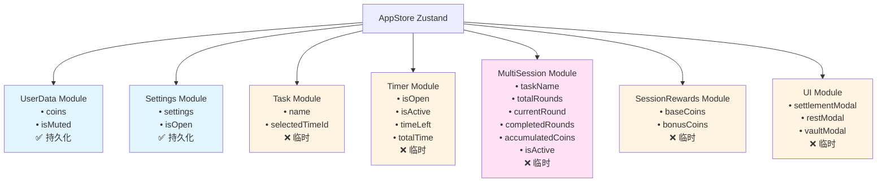

## 多轮学习流程状态转换图

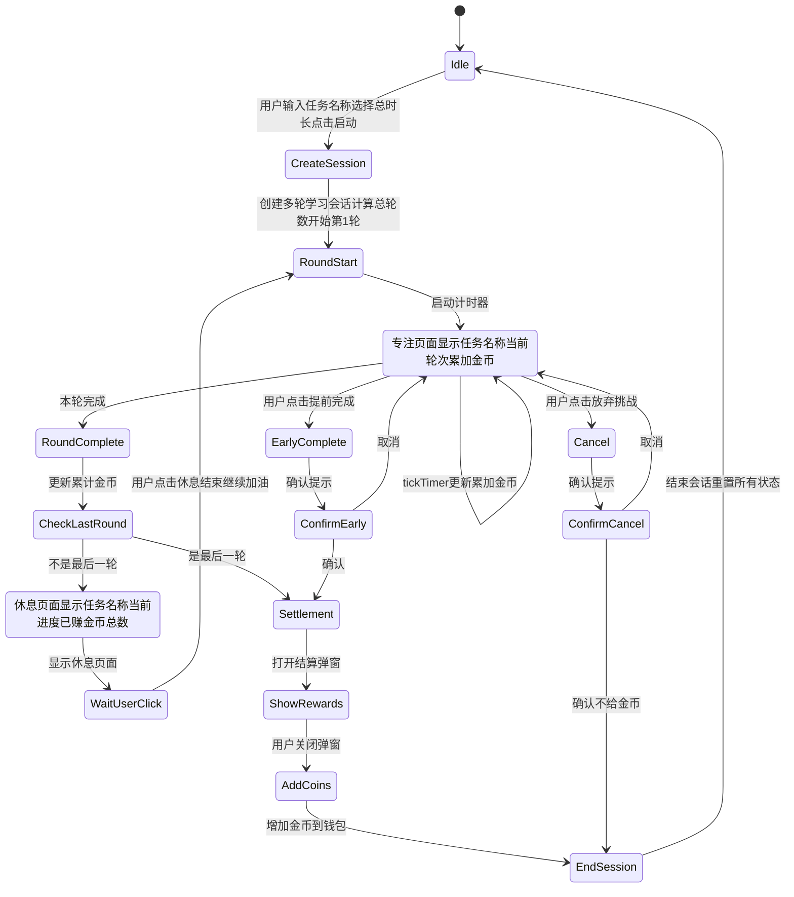

## 模块详细说明

### 新增：MultiSession 模块（多轮学习会话）

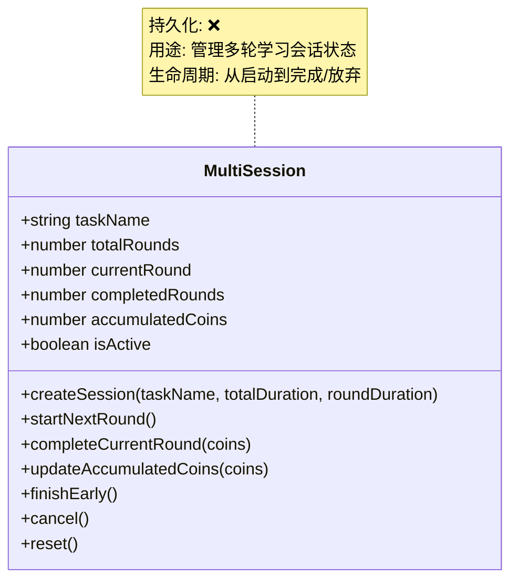

**状态说明：**
- `taskName`: 任务名称（在整个多轮学习过程中保持不变）
- `totalRounds`: 总轮数（总时长 ÷ timerOverride）
- `currentRound`: 当前是第几轮（1-based）
- `completedRounds`: 已完成的轮数
- `accumulatedCoins`: 累计金币数（用于显示）
- `isActive`: 是否正在进行多轮学习

**Actions：**
- `createSession(taskName, totalDuration, roundDuration)`: 创建多轮学习会话
  - `totalDuration`: 总时长（分钟，来自用户选择的 selectedTimeId）
  - `roundDuration`: 每轮时长（分钟，来自 settings.timerOverride）
- `startNextRound()`: 开始下一轮（currentRound++，重置计时器）
- `completeCurrentRound(roundCoins)`: 完成当前轮次
  - `roundCoins`: 当前轮次获得的金币数（基于每轮时长计算）
  - 更新 `accumulatedCoins` += roundCoins
  - `completedRounds++`
- `updateAccumulatedCoins(timePassed, totalTime)`: 更新累计金币显示（计时器 tick 时调用）
  - `timePassed`: 已过去的时间（秒）
  - `totalTime`: 当前轮次总时间（秒）
  - 用于实时显示累计金币（Math.floor((timePassed / 60) * 5)）
- `finishEarly()`: 提前完成所有轮次（使用当前 accumulatedCoins 打开结算弹窗）
- `cancel()`: 取消多轮学习（中途放弃，不给金币）
- `reset()`: 重置所有状态

### 1. UserData 模块（用户数据）

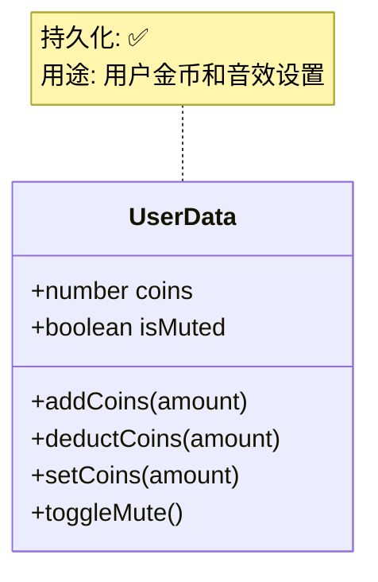

**为什么独立模块？**
- 金币是核心业务数据，需要持久化
- 音效设置是用户偏好，需要持久化
- 这两个数据生命周期长，独立管理更清晰

---

### 2. Settings 模块（应用设置）

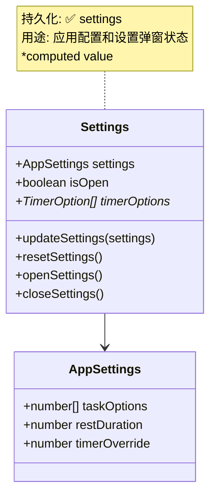

**为什么独立模块？**
- 设置数据需要持久化，影响整个应用行为
- 设置弹窗状态是 UI 状态，但和设置数据紧密相关
- 提供 computed 值（timerOptions）供其他模块使用

---

### 3. Task 模块（任务信息）

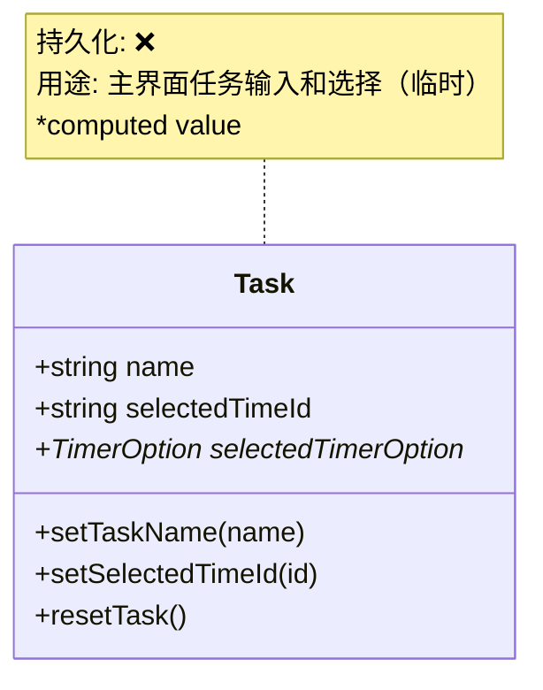

**为什么独立模块？**
- 任务信息是用户在主界面的输入，不需要持久化
- 每次学习都是新任务，独立管理更清晰
- 提供 computed 值（selectedTimerOption）获取选中的时间档位信息
- **作用范围**：仅用于主界面的输入和选择，创建 MultiSession 后不再使用
- **在多轮学习期间，任务名称由 MultiSession 管理**

---

### 4. Timer 模块（计时器状态）

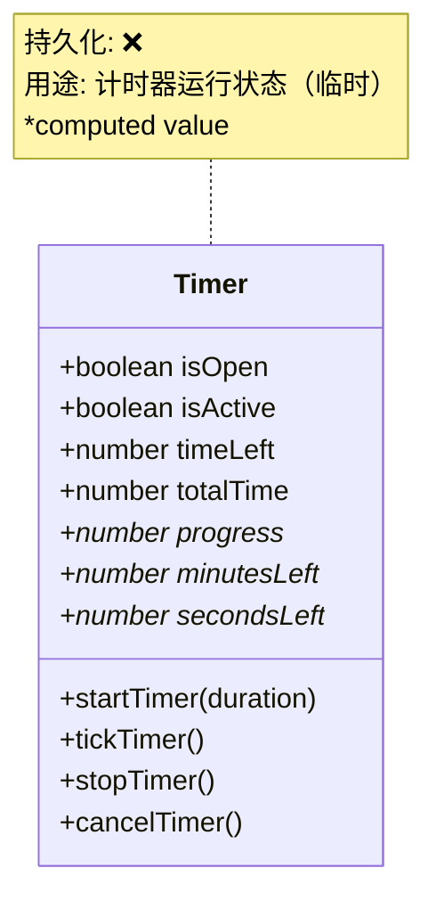

**为什么独立模块？**
- 计时器是核心功能，状态复杂
- 需要多个 actions 控制不同状态
- 提供 computed 值方便组件使用
- 临时状态，不需要持久化
- **在多轮学习期间：**
  - `timeLeft`: 当前轮次的剩余时间（秒）
  - `totalTime`: 当前轮次的总时间（秒，即每轮的时长 timerOverride）
  - 需要显示任务名称和当前轮次信息（从 MultiSession 获取）
  - 需要显示累加金币（从 MultiSession.accumulatedCoins 获取）
  - 需要支持"提前完成"和"放弃挑战"按钮

---

### 5. SessionRewards 模块（会话奖励）

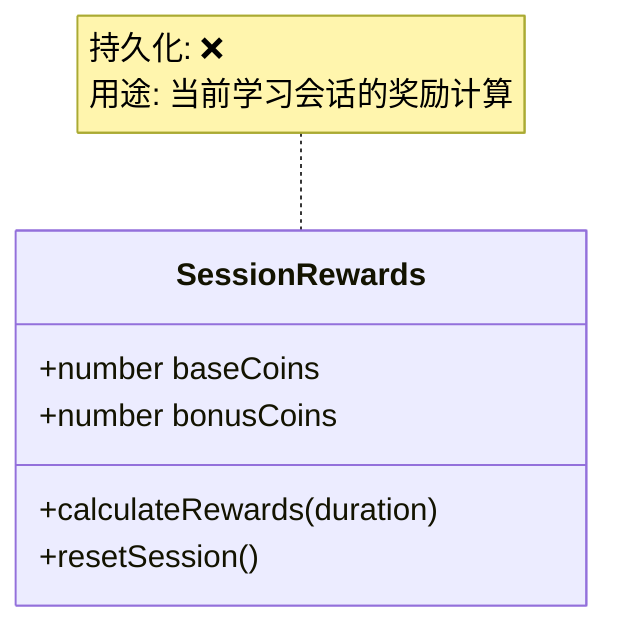

**为什么独立模块？**
- 奖励计算是独立业务逻辑
- 需要区分基础奖励、随机奖励
- 多轮学习会话结束后会重置，不需要持久化
- 与 UserData.coins 分离，避免混淆
- **简化：只保留 `baseCoins` 和 `bonusCoins`（用于最终结算弹窗）**
- **移除 `accumulatedCoins`（由 MultiSession 管理）**
- **`calculateRewards(duration)` 中的 duration 是每轮的时长（分钟），用于计算该轮的基础奖励和随机奖励**

---

### 6. UI 模块（UI 状态）

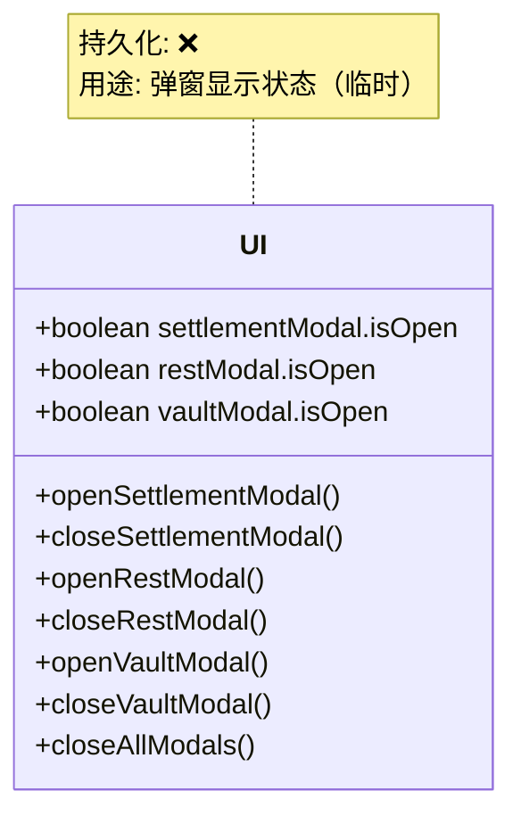

**为什么独立模块？**
- 所有弹窗状态集中管理，避免分散
- 提供统一的操作接口
- 可以批量关闭所有弹窗
- 临时状态，不需要持久化

## 模块间依赖关系

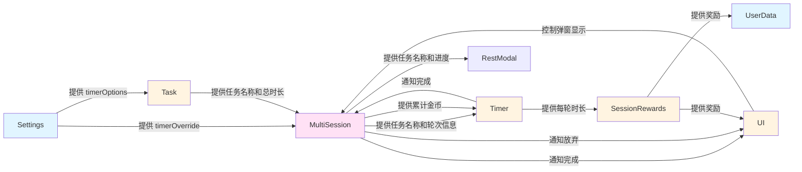

## 持久化策略图

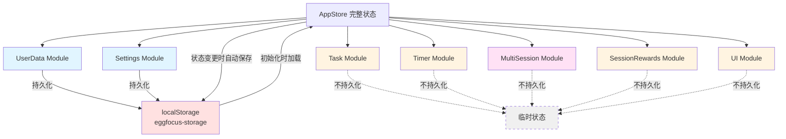

## 数据流向图

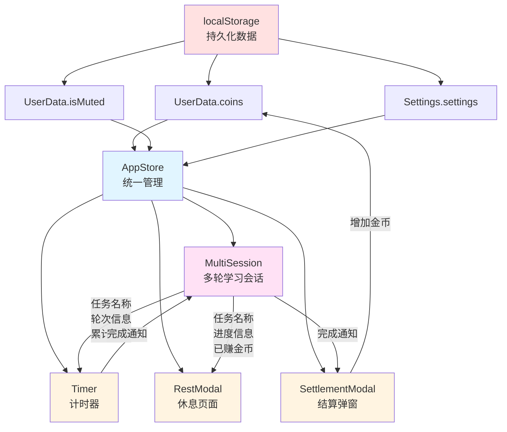

## 关键业务逻辑

### 1. 创建多轮学习会话

```typescript
createSession(taskName: string, totalDuration: number, roundDuration: number) {
  const totalRounds = Math.floor(totalDuration / roundDuration);
  // 初始化 MultiSession 状态
  // taskName = taskName
  // totalRounds = totalRounds
  // currentRound = 1
  // completedRounds = 0
  // accumulatedCoins = 0
  // isActive = true
  // 开始第1轮（调用 Timer.startTimer(roundDuration * 60)）
}
```

### 2. 完成当前轮次

```typescript
completeCurrentRound(roundCoins: number) {
  // roundCoins: 当前轮次获得的金币（基于每轮时长计算：Math.ceil(roundDuration * 5)）
  // 更新累计金币：accumulatedCoins += roundCoins
  // completedRounds++
  // 判断是否是最后一轮（currentRound === totalRounds）
  // 如果是最后一轮：
  //   - 计算总奖励（基于总时长计算 baseCoins + bonusCoins）
  //   - 打开结算弹窗（显示总金币）
  // 如果不是最后一轮：
  //   - 进入休息页面（不显示结算弹窗，不真正给金币）
}
```

### 3. 提前完成

```typescript
finishEarly() {
  // 确认提示："确定要提前完成吗？"
  // 如果确认：
  //   - 计算总奖励（基于已完成轮次的总时长）
  //   - 使用当前 accumulatedCoins 打开结算弹窗
  //   - 用户关闭弹窗后，真正给金币
  //   - 结束会话，重置所有状态
}
```

### 4. 中途放弃

```typescript
cancel() {
  // 确认提示
  // 不给金币
  // 立即结束会话
  // 重置所有状态
}
```

## 为什么这样划分？

### 1. **按生命周期划分**
- **持久化模块**：UserData, Settings（需要保存）
- **临时模块**：Task, Timer, MultiSession, SessionRewards, UI（不需要保存）

### 2. **按职责划分**
- **数据模块**：UserData（用户数据）
- **配置模块**：Settings（应用配置）
- **业务模块**：Task, Timer, MultiSession, SessionRewards（核心业务逻辑）
- **UI 模块**：UI（界面状态）

### 3. **按使用频率划分**
- **高频访问**：Timer, UI（用户交互频繁）
- **低频访问**：Settings（偶尔修改）
- **中频访问**：Task, MultiSession, SessionRewards, UserData

### 4. **避免状态混乱**
- 每个模块职责单一，不会互相干扰
- 状态更新路径清晰，易于调试
- 便于测试和维护

## 与现有实现的对比

### 现有问题：
```
App.tsx 中所有状态混在一起：
  • 15+ 个 useState
  • 多个 useEffect 处理副作用
  • 状态更新逻辑分散在各个 handler 中
  • 难以追踪状态变化
  • 容易出现状态不一致
  • 不支持多轮学习流程
```

### 新设计优势：
```
模块化 Store：
  • 7 个清晰的模块
  • 每个模块职责单一
  • Actions 封装业务逻辑
  • Computed 值自动计算
  • 状态更新路径清晰
  • 易于测试和维护
  • 完整支持多轮学习流程
```

## Store 设计总结

本 Store 设计包含 **7 个核心模块**，完整支持多轮学习流程：

### 核心特性

1. ✅ **多轮自动学习**：系统自动管理多轮学习，用户只需启动一次
2. ✅ **累加显示金币**：专注页面实时显示累计金币（+0, +5, +10...）
3. ✅ **任务信息展示**：专注和休息页面都显示任务名称和轮次信息
4. ✅ **提前完成支持**：用户可以随时提前完成，获得已完成轮次的金币
5. ✅ **中途放弃处理**：用户可以选择放弃，已完成的轮次不给金币
6. ✅ **完整结算机制**：只有全部完成或提前完成时才真正给金币
7. ✅ **状态管理清晰**：模块职责明确，易于维护和扩展

### 模块清单

- **UserData**：用户数据（金币、静音设置）- 持久化
- **Settings**：应用设置（时间档位、休息时长等）- 持久化
- **Task**：任务信息（任务名称、选中时间）- 临时
- **Timer**：计时器状态（运行状态、剩余时间等）- 临时
- **MultiSession**：多轮学习会话（轮次、进度、累计金币等）- 临时
- **SessionRewards**：会话奖励（基础金币、随机奖励）- 临时
- **UI**：弹窗状态（结算、休息、金库等）- 临时

### 设计原则总结

这个 Store 设计遵循了：
1. **单一职责原则**：每个模块只管理一类状态
2. **关注点分离**：持久化状态和临时状态分开
3. **可维护性**：模块化设计便于理解和修改
4. **可扩展性**：新增功能只需添加新模块或扩展现有模块
5. **类型安全**：完整的 TypeScript 类型定义

